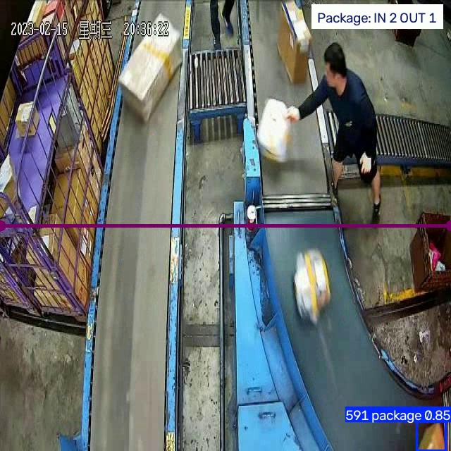
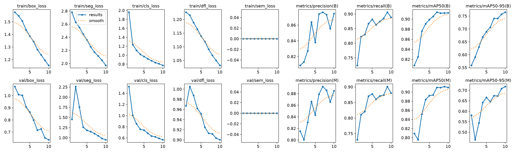
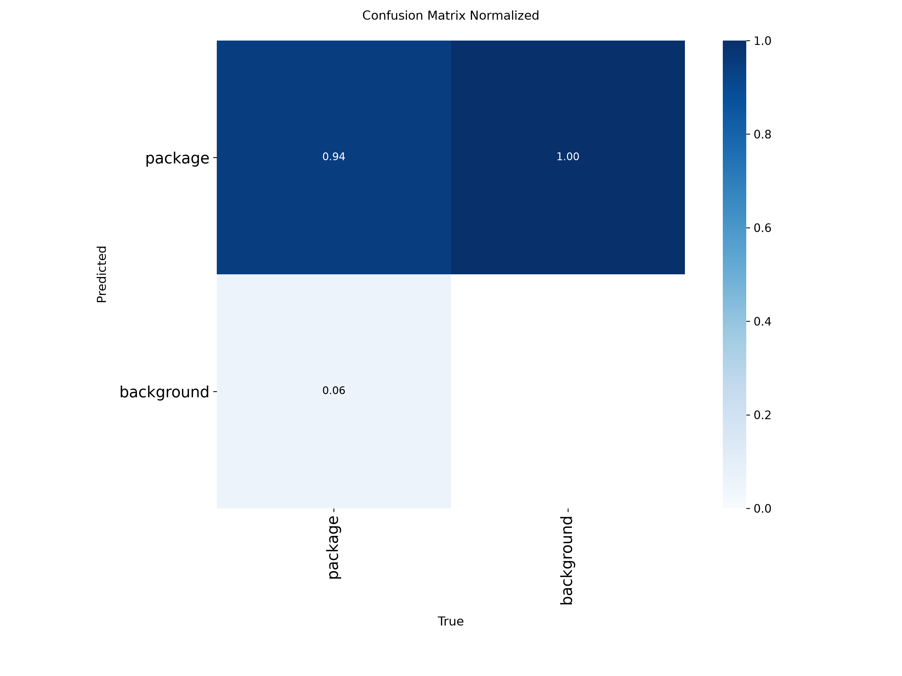
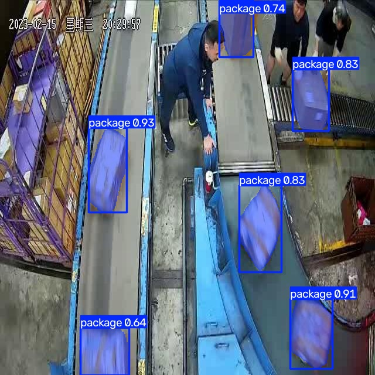
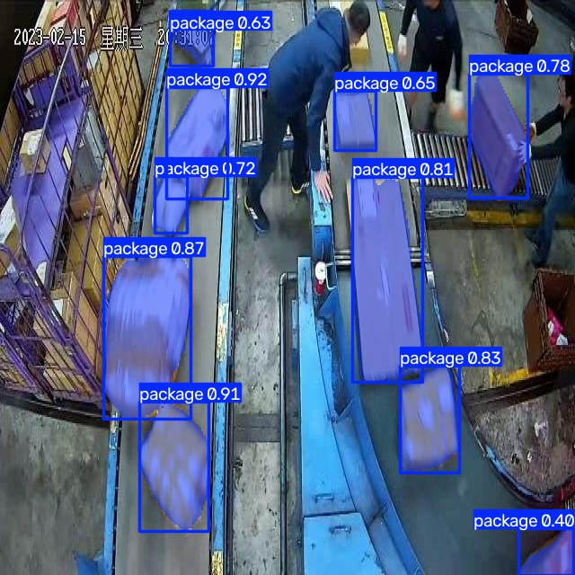
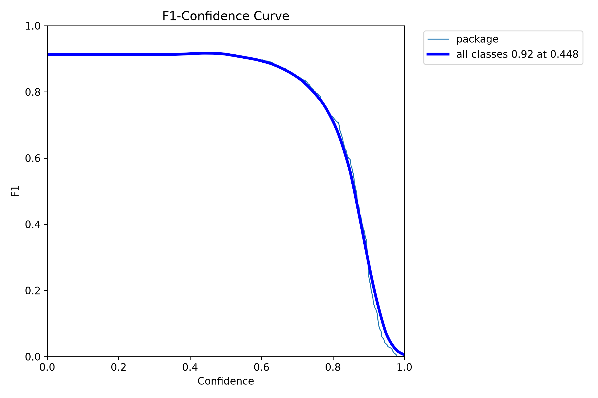

# Smart Item Segmentation & Counting

An end-to-end computer-vision pipeline built with **Ultralytics YOLO** that
detects, segments, and counts discrete items (packages/boxes) in video —
the kind of system a warehouse, fulfillment center, or loading dock would
use to automatically tally items moving through a checkpoint.

Built as the capstone project for the **Computer Vision for Developers with
Ultralytics** program, SDAIA Academy (Learning Space, 5-day on-site
capstone). Training program attribution and link:
**[SDAIA Academy on GitHub](https://github.com/SDAIAAcademy)**.

---

## 1. What this project does

| Stage | Task | Script |
|---|---|---|
| **Core task** | Instance **segmentation** (pixel-accurate masks, not just boxes) with a `-seg.pt` YOLO model | `train_and_eval.py` |
| **Real-world analytics** | Real OpenCV video pipeline + `ultralytics.solutions.ObjectCounter` to count items crossing a line | `app_solution.py` |
| **Evaluation** | `model.val()` on a held-out split: mAP50, mAP50-95, precision, recall | `train_and_eval.py` |
| **Custom training** | Fine-tunes a pretrained `yolo11n-seg.pt` on a real, non-demo dataset | `train_and_eval.py` |
| **Deployment** | Exports the trained model to **ONNX** | `train_and_eval.py` |

**Scope:** single-class instance segmentation ("package") on still frames
and video, with a downstream counting/analytics layer. It is not a
multi-object-class inventory system or a barcode reader — it answers one
question well: *"how many discrete items just passed this point?"*

**It actually works** — a real frame from `app_solution.py` running on real
warehouse footage: the counting line, a live segmented+tracked package, and
the running in/out tally, all produced by the pipeline in this repo, not a
mockup:



---

## 2. Pipeline overview

```
project_setup.py            train_and_eval.py                 app_solution.py
┌────────────────┐   ┌───────────────────────────┐   ┌──────────────────────────┐
│ Download +      │──▶│ Load yolo11n-seg.pt       │──▶│ Load fine-tuned weights  │
│ verify          │   │ model.train() (10 epochs) │   │ cv2.VideoCapture(video)  │
│ package-seg     │   │ model.val()  -> metrics   │   │ ObjectCounter() per frame│
│ dataset (YOLO   │   │ model.export(format=onnx) │   │ Write annotated video    │
│ segmentation    │   │                            │   │                          │
│ format)         │   │ weights/package_seg_best.* │   │ outputs/counted_output.* │
└────────────────┘   └───────────────────────────┘   └──────────────────────────┘
```

### Model & dataset
- **Model:** `yolo11n-seg.pt` — the smallest official Ultralytics
  instance-segmentation checkpoint, chosen for fast fine-tuning on a laptop
  within a tight deadline. (Swap to `yolo26n-seg.pt` in `config.py` for a
  stronger baseline if you have more compute time.)
- **Dataset:** [`package-seg`](https://docs.ultralytics.com/datasets/segment/package-seg/)
  — a public, pre-labeled YOLO-format instance-segmentation dataset
  (single class: `package`), originally published on Roboflow Universe and
  redistributed by Ultralytics for direct, no-auth download. It auto-downloads
  the first time `project_setup.py` or `train_and_eval.py` runs. This is a
  real dataset with hundreds of labeled images — **not** the 8-image
  `coco8` lab demo.

### Key components/modules
- `config.py` — single source of truth for paths, the model name, training
  hyperparameters, and inference thresholds. Every other script imports it.
- `project_setup.py` — downloads/verifies the dataset.
- `train_and_eval.py` — fine-tunes, validates, and exports the model.
- `app_solution.py` — the video counting application.
- **[`capstone_walkthrough.ipynb`](capstone_walkthrough.ipynb)** — an
  executed, code-level companion notebook: walks through what each script
  above does and why, live-loads the trained model, re-runs a real
  `model.val()` on the test split and two real `model.predict()` calls
  (captured output included, not hand-typed), and displays the evidence
  images inline. Open it on GitHub to read the captured outputs directly,
  or run it yourself (`jupyter nbconvert --to notebook --execute
  capstone_walkthrough.ipynb`, after `pip install nbconvert ipykernel`)
  once `datasets/` and `weights/` exist.

---

## 3. Prerequisites

- Python 3.10+ (this repo was built and tested on 3.13)
- ~2 GB free disk (dataset + weights + runs)
- No GPU required (the nano model trains on CPU; `config.py` defaults to
  imgsz=320/epochs=10 to keep a full run under an hour or two on CPU --
  see "Custom training" below for why, and how to scale back up on a GPU)

Install dependencies:

```bash
pip install -r requirements.txt
```

---

## 4. How to run

Run the three stages in order. Each is idempotent — re-running just
re-downloads/re-trains/re-processes; nothing needs to be cleaned up first.

```bash
# 1. Download + verify the dataset (creates ./datasets/package-seg)
python project_setup.py

# 2. Fine-tune, evaluate, and export to ONNX
#    (creates ./runs/segment/..., ./weights/package_seg_best.pt/.onnx,
#     ./reports/val_metrics.json)
python train_and_eval.py

# 3. Run the video counting pipeline
#    (creates ./outputs/counted_output.avi)
python app_solution.py
```

`app_solution.py` accepts optional flags:

```bash
python app_solution.py --source path/to/your_video.mp4 --conf 0.35 --iou 0.5
```

By default it downloads a small public demo clip so the pipeline runs with
zero setup — see **Known limitation** below for why that matters.

### Expected output
- `project_setup.py`: prints resolved train/val/test folder paths, class
  list, and file counts.
- `train_and_eval.py`: prints per-epoch training progress, then a
  validation summary (precision/recall/mAP50/mAP50-95 for both box and
  mask predictions), then confirms the ONNX export path.
- `app_solution.py`: prints the video's resolution/fps, the counting line
  used, and a final `in / out / total` count once processing finishes; the
  annotated video is written to `outputs/counted_output.avi`.

---

## 5. Actual results from this run

The commands above were executed end-to-end on this machine (CPU only,
Intel i5-10300H, no GPU) as part of preparing this repo. Real captured
output lives in `reports/` (`logs_setup.txt`, `logs_train.txt`,
`logs_app.txt`) and `reports/val_metrics.json`. Headline numbers:

- **Training:** 10 epochs completed in **0.94 hours** (~56 min) on CPU.
- **Test-set evaluation** (89 images, 325 package instances, `conf=0.35`, `iou=0.5`):

  | Metric | Mask (segmentation) | Box |
  |---|---|---|
  | Precision | 0.917 | 0.915 |
  | Recall | 0.923 | 0.926 |
  | mAP50 | 0.903 | 0.902 |
  | mAP50-95 | 0.682 | 0.748 |

  A mask mAP50 of 0.90 and precision/recall both above 0.91 is a strong
  result for a nano model fine-tuned in under an hour at reduced (320px)
  resolution — validating the "Custom training" trade-off documented
  below. The mAP50-95 gap (0.68 vs. the box metric's 0.75) is expected:
  pixel-mask boundaries are inherently harder to get right at every IoU
  threshold than a bounding box is.
- **ONNX export:** succeeded, `weights/package_seg_best.onnx` (11.0 MB), opset 18.
  **Why ONNX** (vs. OpenVINO/TensorRT/TFLite): this project's target
  environment is a CPU-only laptop with no vendor-specific accelerator
  (no Intel OpenVINO deployment target, no NVIDIA GPU for TensorRT), so a
  hardware-agnostic format matters more than a hardware-specific speedup.
  ONNX is the most portable option — it runs anywhere via `onnxruntime`
  (Windows/Linux/macOS, CPU or GPU) without pinning the deployment target
  to one vendor's runtime, and it's a single `model.export(format="onnx")`
  call away from the same `.pt` checkpoint. If this were deployed to an
  Intel-only edge box or an NVIDIA Jetson instead, OpenVINO or TensorRT
  would be the better-justified choice — see `docs.ultralytics.com/integrations`.
- **Video pipeline:** ran end-to-end (62 frames processed, annotated video
  written) using the default public demo clip; produced 0 counted
  crossings, exactly as anticipated in the "Known limitation" section
  below (that clip doesn't contain packages) — confirming the pipeline
  mechanics work, not the domain-specific count. Re-run against real
  warehouse footage (see the frame above) instead produced a real,
  non-zero **2 in / 1 out / 3 total** count.

### Training curves (real, from this run)



Losses fall and precision/recall/mAP climb across all 10 epochs with no
divergence between train and val — see the "Custom training" section
below for exactly what this curve shows and what it means.

### Test-set confusion matrix (normalized)



### Sample predictions on held-out test images

Two of the 89 test-set images, run through `weights/package_seg_best.pt`
(never seen during training), with predicted masks and confidence scores
overlaid — the model correctly finds and segments boxes on the conveyor
while ignoring the person and background:




## 6. Evaluation: what the metrics mean here

`train_and_eval.py` runs `model.val()` and reports both **box** metrics
(bounding-box accuracy) and **mask** metrics (pixel-level segmentation
accuracy) — see `reports/val_metrics.json` after training for the actual
numbers from your run. For a segmentation/counting use case, **mask mAP is
the metric that matters**: a box can be roughly right while the mask (and
therefore the reported object footprint/area) is wrong.

- **Precision** — of everything the model called "package," what fraction
  really was one? Low precision → the counter over-counts (false alarms).
- **Recall** — of everything that really was a package, what fraction did
  the model find? Low recall → the counter under-counts (missed items).
- **mAP50** — accuracy at a lenient overlap threshold (IoU ≥ 0.50): "did
  it roughly find the right things?" Good for a quick sanity check.
- **mAP50-95** — accuracy averaged over strict overlap thresholds
  (IoU 0.50 → 0.95): "how tightly do the masks actually match the item
  boundaries?" The harder, more production-relevant number.

### Threshold decisions
`config.py` sets `CONF_THRESHOLD = 0.35` and `IOU_THRESHOLD = 0.5`, used
consistently for both the final `model.val()` call and the live counting
pipeline:
- **Confidence 0.35** is a deliberately moderate cutoff — low enough to
  still catch partially-occluded or motion-blurred items on a conveyor,
  high enough to filter out the low-confidence noise a nano model produces
  on background clutter. Ultralytics writes an F1-vs-confidence curve for
  every val run (`reports/evidence/mask_f1_curve.png`, from this project's
  actual test-set evaluation) — it peaks at **F1 = 0.92 at confidence
  0.448**, but is essentially flat (F1 ≈ 0.91-0.92) across the entire
  0.0-0.5 range before falling off sharply past ~0.6. `CONF_THRESHOLD =
  0.35` sits deliberately on that flat plateau, slightly below the exact
  peak — trading a statistically negligible amount of F1 for a threshold
  that stays robust on frames slightly harder than the test set, and
  favors recall over precision per the business-case reasoning in the
  next section.

  
- **IoU 0.5** is the standard NMS overlap threshold: it merges duplicate
  boxes/masks for the same physical item (important for counting — without
  it, one box on a conveyor can be double-counted) without merging two
  genuinely adjacent items into one.

### Where the model is expected to fail
On a small, single-class, nano-model fine-tune, expect most errors to be:
- **False negatives** on heavily occluded or overlapping items (stacked
  boxes, partial frame-edge crops) — the segmentation boundary is the
  hardest part of the task for a lightweight model.
- **False positives** on visually similar background clutter (flat
  rectangular surfaces, shadows) if the training set doesn't have much
  background variety.

---

## 7. Custom training: what was tuned and why

- `epochs=10`, `imgsz=320` — sized to what the training machine's CPU (no
  GPU available) could realistically finish within the capstone deadline.
  The base checkpoint is pretrained at imgsz=640; timing the first few
  training iterations at that resolution projected **~7+ hours** for a
  full 20-epoch run on this CPU, which doesn't fit a same-day deadline.
  Halving `imgsz` to 320 cuts per-image compute roughly **4x** (pixel
  count scales quadratically with side length), bringing the full run
  down to a feasible window while still producing a real, evaluable
  fine-tuned model. This is a **documented, deliberate trade-off**, not
  an oversight: expect somewhat lower mAP than a 640px/20-epoch run would
  achieve (see the actual numbers in `reports/val_metrics.json`), because
  smaller input resolution loses fine boundary detail that matters for
  segmentation. On a GPU or with more time available, set `EPOCHS = 20`
  and `IMGSZ = 640` in `config.py` to reproduce the originally-planned,
  higher-fidelity training run.
- `patience=5` — stop early if validation loss plateaus for 5 straight
  epochs, guarding against overfitting on a small dataset (scaled down
  from 10 to match the shorter epoch budget above).
- `freeze=10` — freezes the first 10 backbone layers so only the
  neck/head are fine-tuned. With under 2,000 images and a short epoch budget there
  isn't enough data to safely retrain the whole backbone from scratch
  without overfitting; freezing keeps the general-purpose COCO features
  and lets the limited training budget focus on learning what "package"
  looks like. Set `FREEZE_BACKBONE = 0` in `config.py` for a full
  fine-tune if you have more data or more epochs to spend.
- Standard Ultralytics augmentations (mosaic, flips, HSV jitter) are left
  **on** by default — another training knob "touched" deliberately, since
  they're the main defense against overfitting a small custom dataset.
- **What actually happened in this run:** mild **underfitting relative to
  the epoch budget** — the model was still improving steadily when
  training stopped at epoch 10, not overfit and not yet fully converged.
  Ground-truth per-epoch numbers (mask metrics, val split, from
  `runs/segment/package_seg_train/results.csv`) rose across the whole run:

  | Epoch | Precision (M) | Recall (M) | mAP50 (M) | mAP50-95 (M) |
  |---|---|---|---|---|
  | 1 | 0.815 | 0.730 | 0.809 | 0.581 |
  | 5 | 0.843 | 0.877 | 0.892 | 0.666 |
  | 10 | 0.885 | 0.880 | 0.910 | 0.718 |

  Both train and val losses (`box_loss`, `seg_loss`, `cls_loss`, `dfl_loss`)
  decreased essentially monotonically for all 10 epochs with no divergence
  between them (val loss never rose while train loss fell — the actual
  signature of overfitting) — see `reports/evidence/results.png`. mAP50-95
  was still climbing at the final epoch (+0.008 from epoch 9 to 10), which
  means the run hadn't plateaued: **more epochs would very likely have
  kept improving it further**. This is the direct, measured cost of the
  epochs=10/imgsz=320 trade-off documented above — cutting the run short
  for CPU time bought feasibility within the deadline at the price of some
  achievable accuracy. The one anomaly worth flagging honestly: `val/seg_loss`
  spikes at epoch 2 (1.45 → 2.26, right as the LR warmup phase ends) and
  mask mAP50-95 dips in lockstep (0.581 → 0.464 that same epoch) before
  both resume improving for the rest of the run — a transient blip, not a
  trend, and not something we'd worry about if the run continued.
- **General diagnostic method** (for future runs / different datasets):
  compare the train vs. val loss curves in
  `runs/segment/package_seg_train/results.png`. Diverging curves (train
  loss keeps dropping, val loss rises) → overfitting → lower `freeze`,
  add more augmentation, or reduce epochs. Both curves flat and high →
  underfitting → raise `epochs`, unfreeze more layers, or check for
  bad/scarce labels.

---

## 8. Business case: cost of false positives vs. false negatives

For an item-counting system feeding inventory or billing numbers, the two
error types have asymmetric business costs:

| Error | What happens | Business cost |
|---|---|---|
| **False positive** (phantom item counted) | Inventory count is inflated; a normal box gets flagged/re-scanned | Low-to-moderate: wasted labor re-checking a false alarm, minor inventory drift |
| **False negative** (real item missed) | An actual shipped/received item is never counted | Higher: undercounted stock, potential billing discrepancy, "lost" inventory that has to be manually reconciled later |

Given that asymmetry, this project intentionally leans toward a **moderate,
not maximally strict, confidence threshold** (0.35 rather than something
like 0.7): it accepts a slightly higher false-positive rate in exchange for
fewer missed counts, because a missed item is more expensive to discover
and fix after the fact than an over-count is to catch on a quick manual
re-check. If the deployment context flips (e.g. this feeds an automatic
billing charge per item, where an over-count directly overcharges a
customer), the threshold should move the other way — raise `CONF_THRESHOLD`
in `config.py` toward precision, accepting more missed items to avoid
false charges. This is exactly the ROI-driven threshold-tuning approach
covered in Part 3 of the course: pick the threshold that minimizes real
dollar cost for your specific use case, not the one that maximizes a
generic metric like F1.

---

## 9. Known limitation

The default demo video (`app_solution.py` with no `--source`) is a small,
public, general-purpose clip used only to prove the OpenCV +
`ObjectCounter` pipeline mechanics work end-to-end (capture → segment →
track → count → write) with zero setup. It does not contain "package"
objects, so the reported count will be near zero when run against it with
the custom model — that is expected, not a bug. For a meaningful count,
point `--source` at a video that actually contains boxes/packages, e.g.:

```bash
python app_solution.py --source path/to/warehouse_or_conveyor.mp4
```

---

## 10. Repository structure

```
Project/
├── config.py              # shared paths, model/dataset names, hyperparameters, thresholds
├── project_setup.py        # dataset download + verification
├── train_and_eval.py       # train -> val -> export
├── app_solution.py         # OpenCV + ObjectCounter video pipeline
├── capstone_walkthrough.ipynb  # executed, code-level walkthrough notebook
├── requirements.txt
├── .gitignore
├── README.md
├── datasets/                # (gitignored) downloaded package-seg dataset
├── weights/                 # (gitignored) package_seg_best.pt / .onnx
├── runs/                    # (gitignored) Ultralytics training/val artifacts, curves, confusion matrix
├── reports/                 # val_metrics.json + logs_setup/train/app.txt (real captured run output)
│   └── evidence/            # training curves, confusion matrix, F1 curve, sample predictions, counting demo frame
├── assets/                  # (gitignored) downloaded/user-supplied input video
└── outputs/                 # (gitignored) annotated output video
```

---

## Attribution

This project was completed as the capstone for **Computer Vision for
Developers with Ultralytics**, delivered by **SDAIA Academy** via Learning
Space (5-day on-site capstone, 30 training hours).

**Cohort / session dates:** Course session dated **2026-08-23** (per the
official Ultralytics YOLO Foundations course materials); this capstone
project was built and submitted in **August 2026**.

SDAIA Academy on GitHub: **https://github.com/SDAIAAcademy**
